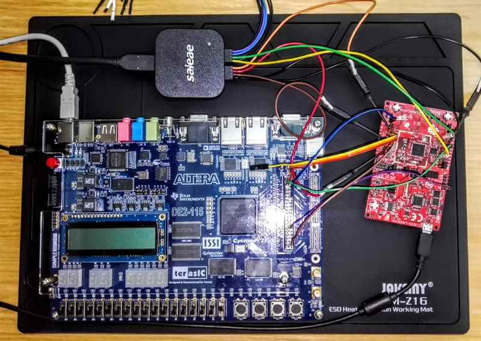

<h1 align='center'>Hybrid FPGA/SOC Wireless Transmission</h1>

# Project Overview

This application is used to transmit data from a FPGA to a PC through WiFi (via a WiFi capable MCU, the CC3200 from TI), up to 8 Mbits/sec.
 
A FPGA receive data from several sensors, store them in memory and transmit them to a Microcontroller (MCU) through a SPI connexion. 
 
The MCU first connect itself to an Access point (WiFi) and then to a receiving server (in our case a python app). 
 
Afterward, the MCU start accepting the SPI data sent from the FPGA and store them in a Ring Buffer. 
 
Once the ring buffer is full enough, the MCU send data to a computer through the TCP/IP protocol. 
 
Meanwhile, it still receives data from the SPI. 
 
These parallel processes (SPI reception, TCP transmission) repeat endlessly as long as the (socket) connexion between the MCU and the PC stays alive.

 

# Components and Software Used: 

- OS
    - Windows (all tools are available on Linux)

- FPGA
    - Altera DE2-115
    - Quartus II 13.1

- SOC
    - Ti CC3200 launchpad
    - Code Composer Studio

- Debug
    - Putty
    - Logic analyser

- PC Receiver
    - Linux (netcast)
    - Pythoneripheral on the chip are used. In our case, 5/6 Mbits per second is a more reasonable throughput. 

 

# Repository's folders:

### FPGA/
Contains the verilog code/description for the FPGA transmission

### MCU/
Contains the C code for the CC3200 from TI (wireless app MCU)

### PC_RECEIVER/
Contains the python code to receive data and perform a integrity test on them.
 
This is a terminal/console application.

### Support/
Contains the user manua

 

# For more info, please read the user manual
<a href="https://github.com/pseudoincorrect/FPGA_MCU_wifi/support/FPGA_SOC_Wireless_Transmission_User_Manual.pdf">MANUAL</a>